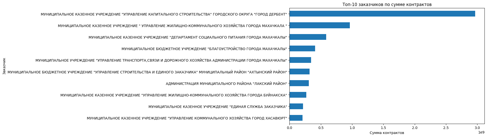
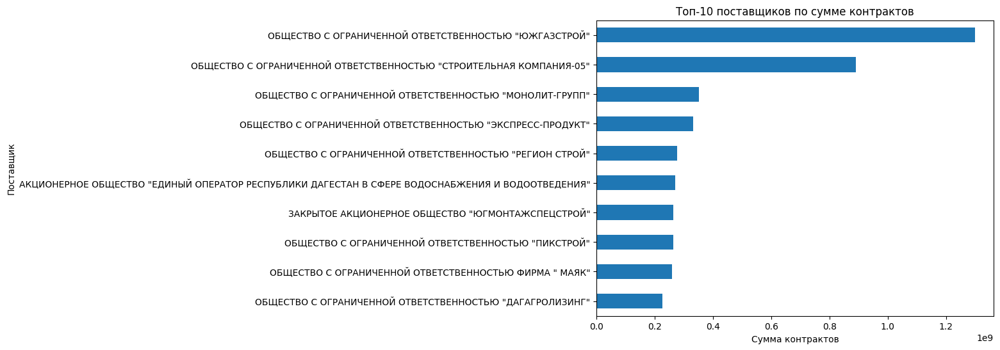
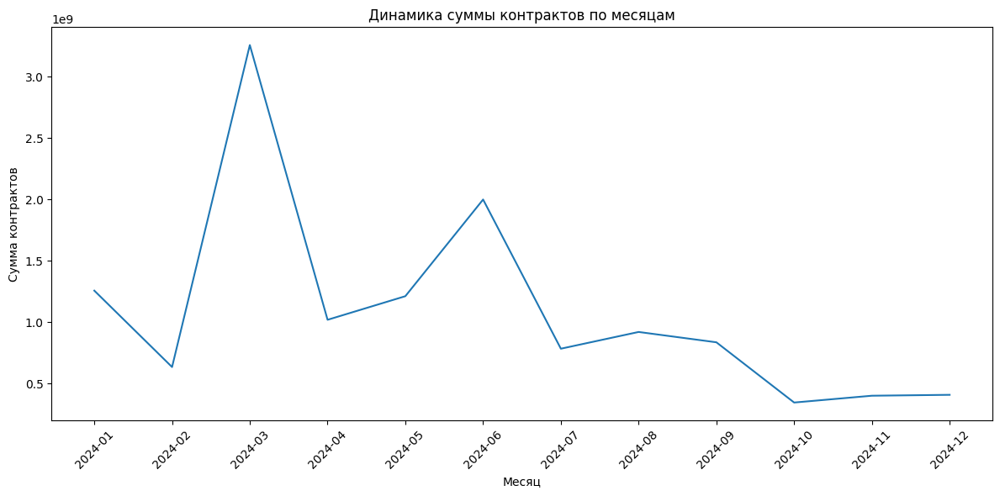

# Procurement Analytics Portfolio Project

## Описание проекта
Данные для проекта были получены из ЕИС (Единой информационной системы) путем выгрузки контрактов с применением фильтров по Республике Дагестан за 2024 г.
сам csv файл решил удалить из папки data_raw в целях соблюдения закона о персональных данных (авось что-то изменится, улчше подстрахуюсь)

Проект посвящен анализу данных о государственных и муниципальных контрактах на основе CSV-выгрузки.  
Цель проекта — продемонстрировать навыки подготовки данных, построения аналитических датасетов, проведения исследовательского анализа и оформления результата в виде портфельного кейса для GitHub.

## Цель проекта
- очистить и структурировать сырые данные по контрактам;
- разделить данные на уровень контрактов и уровень позиций закупки;
- провести первичный исследовательский анализ;
- выявить ключевые закономерности в структуре закупок;
- оформить результат в виде воспроизводимого аналитического проекта.

## Данные
Источник данных — CSV-выгрузка по контрактам и объектам закупки.

Исходный файл содержит:
- 10 701 строку;
- 29 столбцов;
- 3 851 уникальный контракт.

Особенность структуры данных: один контракт может включать несколько позиций закупки, поэтому исходный файл был разделен на несколько аналитических таблиц.

## Итоговые датасеты
В рамках проекта были собраны следующие таблицы:

- `contracts.csv` — данные на уровне контракта;
- `contract_items.csv` — данные на уровне позиции закупки;
- `customers.csv` — справочник заказчиков;
- `suppliers.csv` — справочник поставщиков.

## Структура проекта
```text
procurement_analytics_portfolio/
│
├── data_raw/               # сырой исходный файл
├── data_processed/         # подготовленные датасеты
├── notebooks/              # Jupyter Notebook с анализом
├── src/                    # Python-скрипты для подготовки данных
├── sql/                    # SQL-скрипты (при дальнейшем развитии проекта)
├── dashboard/              # графики / BI-материалы
├── docs/                   # дополнительные материалы
├── README.md
├── requirements.txt
└── .gitignore

Используемый стек

- Python
- pandas
- numpy
- matplotlib
- Jupyter Notebook
- Git / GitHub

Этапы работы

1. Загрузка и профилирование исходного CSV-файла.
2. Очистка текстовых, числовых и датовых полей.
3. Переименование столбцов в технические имена.
4. Формирование аналитических таблиц contracts, contract_items, customers, suppliers.
5. Проведение первичного исследовательского анализа (EDA).
6. Подготовка графиков и формулировка аналитических выводов.

## SQL-часть проекта
Дополнительно в проект был включен файл `sql/eda_queries.sql`, содержащий набор аналитических SQL-запросов для работы с подготовленными таблицами.

SQL-запросы покрывают следующие задачи:
- расчет общего количества и суммы контрактов;
- определение топ-10 заказчиков по сумме контрактов;
- определение топ-10 поставщиков по сумме контрактов;
- анализ способов закупки по количеству и сумме контрактов;
- анализ помесячной динамики контрактов;
- поиск самых дорогих контрактов;
- анализ объектов закупки по сумме и частоте.

Это позволяет продемонстрировать навыки аналитики как в Python/pandas, так и в SQL.

## Примеры визуализаций

### Топ-10 заказчиков по сумме контрактов


### Топ-10 поставщиков по сумме контрактов


### Динамика суммы контрактов по месяцам


Ключевые выводы

1. Датасет содержит 3,8 тыс. контрактов и 10,7 тыс. строк по позициям закупки.
2. Один контракт может включать несколько позиций, поэтому разделение данных на contracts и contract_items является корректным.
3. Распределение сумм контрактов имеет выраженную правостороннюю асимметрию: большинство контрактов имеют небольшую стоимость, а ограниченное число крупных контрактов формирует значительную долю общего объема.
4. Основной объем закупок концентрируется у ограниченного числа заказчиков и поставщиков.
5. Анализ способов закупки и структуры объектов закупки позволяет выявить ключевые направления закупочной активности.
6. Для части полей характерна высокая доля пропусков, что необходимо учитывать при дальнейшей аналитике.

Ограничения данных

- столбец КОСГУ в предоставленной выгрузке оказался пустым;
- часть бюджетных полей содержит значительное количество пропусков;
- сумма по контрактам и сумма по позициям требует дополнительной сверки с учетом логики формирования исходной выгрузки;
- результаты анализа зависят от полноты и корректности исходной выгрузки из ЕИС.

## Как запустить проект
1. Создать виртуальное окружение:
```bash
python -m venv .venv

Установить зависимости:
.\.venv\Scripts\python.exe -m pip install -r requirements.txt

Установить зависимости:
.\.venv\Scripts\python.exe -m pip install -r requirements.txt

Запустить сборку датасетов:
.\.venv\Scripts\python.exe src\02_build_datasets.py

Открыть Jupyter Notebook и выполнить анализ:
.\.venv\Scripts\python.exe -m notebook

Результат

Проект демонстрирует базовый полный цикл аналитической работы: 
от сырой выгрузки до подготовленных датасетов, первичного анализа и документированного результата, 
пригодного для публикации в GitHub-портфолио.